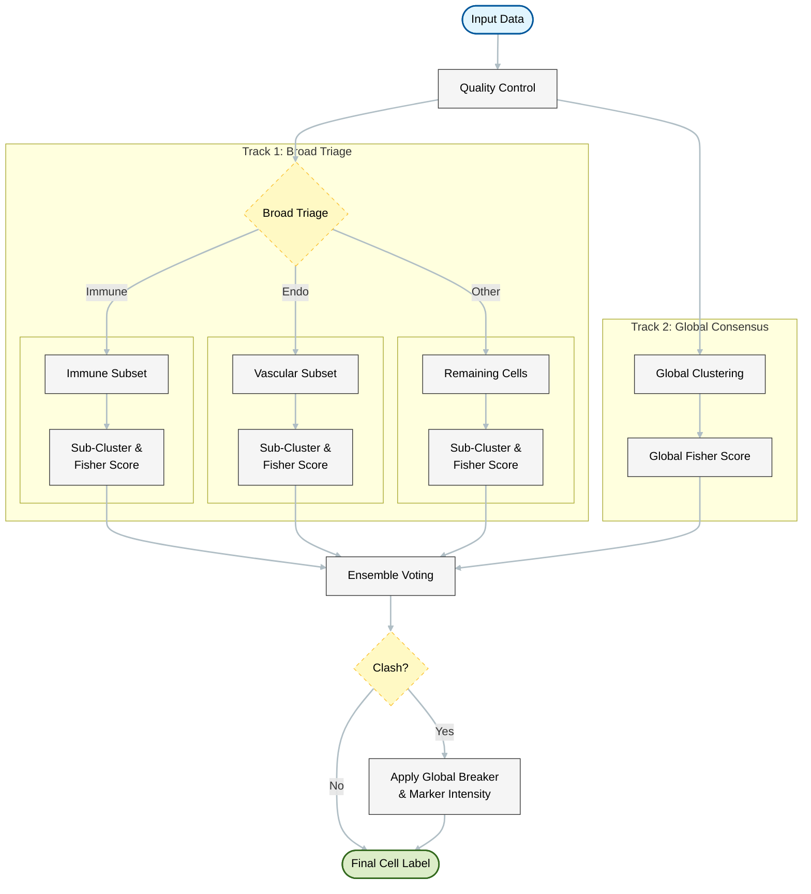

# CellVoteR 

An ensemble-based pipeline for robust cell type classification in single-cell RNAseq data. 

It moves beyond simple "best-match" scoring by integrating multiple classification 
strategies: 
lineage triage, targeted sub-clustering, and global consensus, to generate a 
high-confidence label for every cell.

## How It Works

CellVoteR determines cell identity through a three-stage voting process:

### 1. Broad Triage (divide & conquer)
The dataset is first split into broad biological categories (e.g., *Immune* vs. *Vascular* vs. *Tumour*) 
using defined marker thresholds or coarse clustering. 
This "Triage" step isolates distinct lineages, 
preventing dominant signals from obscuring rare cell types.

### 2. Targeted Sub-clustering
Each broad category is processed independently. Cells are sub-clustered to 
identify fine-grained states, and their identity is determined by 
performing Fisher's Exact Tests against a reference marker panel. 
This ensures that an immune cell is only compared against immune markers, 
reducing false positives.

### 3. Global Consensus (tie-breaker)
Simultaneously, the full dataset is clustered globally (without triage). 
These global labels serve as a "baseline vote." 
In the final ensemble step, if the triage methods disagree, 
the global result and raw marker intensities are used to break the tie and 
resolve the final identity.

## Workflow Diagram



## Installation

You can install the development version of CellVoteR with:

``` r
# install.packages("devtools")
devtools::install_github("ajxa/CellVoteR")
```

## Quick Start

### 1. Quality Control

Before labelling, ensure your data is clean using the built-in QC functions.

``` r
library(CellVoteR)
library(Seurat)

# Load your data (Seurat, SingleCellExperiment, or Matrix)
counts <- Read10X(data.dir = "path/to/data")

# Assess quality (calculates mito/ribo % automatically)
qc_metrics <- assess_cell_quality(counts, 
                                  min_features = 200, 
                                  max_mito_pct = 20)

# Filter the object
clean_obj <- filter_cells(counts, qc_metrics)
```

### 2. Run the Ensemble

Run the full pipeline on your filtered object. You can use the default global methods or enable the full ensemble.

``` r
# Basic Run (General Purpose)
# Uses global clustering and marker matching
labelled_obj <- run_ensemble(clean_obj)

# Advanced Run (Full Ensemble)
# Runs triage methods (1-4) + global breakers (5-6) and resolves clashes
labelled_obj <- run_ensemble(clean_obj, use_ensemble = TRUE)

# View Results
table(labelled_obj$Ensemble_Resolved)
```

### 3. Custom Markers

CellVoteR works with any tissue. Simply provide a dataframe of markers.

``` r
# Define your own markers
my_markers <- data.frame(
  gene = c("EPCAM", "COL1A1", "CD3D"),
  cell_type = c("Epithelial", "Stromal", "T_Cell"),
  category = c("Epithelial", "Stromal", "Immune") 
)

# Run with custom panel
results <- run_ensemble(clean_obj, markers = my_markers)
```
