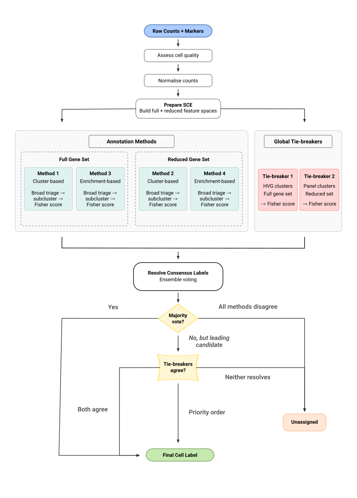

# CellVoteR

CellVoteR is an ensemble-based pipeline for robust cell type annotation
in single-cell RNA-seq data.

Rather than relying on a single best-match score, CellVoteR combines
complementary annotation strategies across full and marker-reduced
feature spaces, then resolves agreement and disagreement through a
configurable consensus voting step.

## Workflow



## Installation

You can install the development version from GitHub:

``` r

# install.packages("devtools")
devtools::install_github("ajxa/CellVoteR")
```

## Quick Start

``` r

markers <- load_markers(file_path = "path/to/input_markers.xlsx")

markers$broad <- build_broad_marker_config(
  marker_list       = markers$broad,
  priority_order    = c("vasculature", "immune"),
  default_threshold = 0.25
)

sce <- create_sce(
  counts        = "path/to/counts.rds",
  cell_metadata = "path/to/metadata.rds"
)

sce <- assess_cell_quality(sce, remove_failed_cells = TRUE)
sce <- normalize_counts(sce)
sce <- prepare_sce(sce, markers)

results <- run_cellvoter(sce)

consensus <- resolve_consensus_labels(
  label_list        = results$labels,
  method_names      = results$method_names,
  tie_breaker_names = results$tie_breaker_names,
  unassigned_label  = "unknown"
)

sce$cellVoteR_label  <- consensus$label
sce$cellVoteR_method <- consensus$method

table(sce$cellVoteR_label)
```

## Learn More

- [Introduction to
  CellVoteR](https://ajxa.github.io/CellVoteR/articles/intro_to_CellVoteR.md)
- [User inputs and required
  formats](https://ajxa.github.io/CellVoteR/articles/user_inputs.md)
- [Preprocessing and analysis
  tracks](https://ajxa.github.io/CellVoteR/articles/preprocessing.md)
- [Annotation
  methods](https://ajxa.github.io/CellVoteR/articles/annotation_methods.md)
- [Consensus and
  results](https://ajxa.github.io/CellVoteR/articles/consensus_and_results.md)
- [Troubleshooting](https://ajxa.github.io/CellVoteR/articles/troubleshooting.md)
